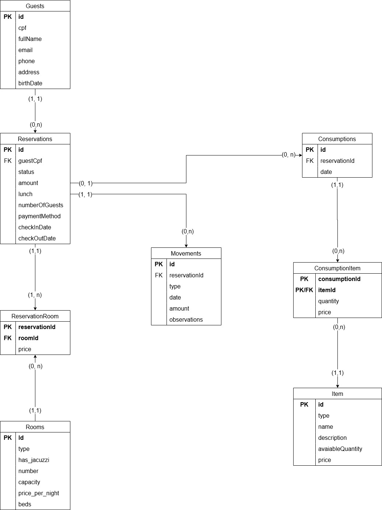

= Poo Test

Projeto apresentado como requisito para dispensa na disciplina

== Critérios de Avaliação

* Utilizar classes abstratas, classes não abstratas, e interfaces;
* Uso adequado da OO: classes e encapsulamento;
* Uso de construtores;
* Aplicação do conceito de herança;
* Uso de Polimorfismo;
* Uso de Collections;
* Uso de Testes Unitários automatizados para cada regra de negócio (BO) e acesso ao BD (DAO);
* Utilizar ao menos 2 padrões de projeto e explicar onde está sendo aplicado;
* Uso de banco de dados (insert, update, delete, select);
* Estruturação do projeto em camadas (View, BO, VO, DAO);
* Uso de exceções (deve-se cria exceções próprias e tratá-las corretamente);

=== Design patterns
* Singleton
* Factory

==== Relacional

==== How to run?

* docker compose up -d --build
* docker attach <container-id>
